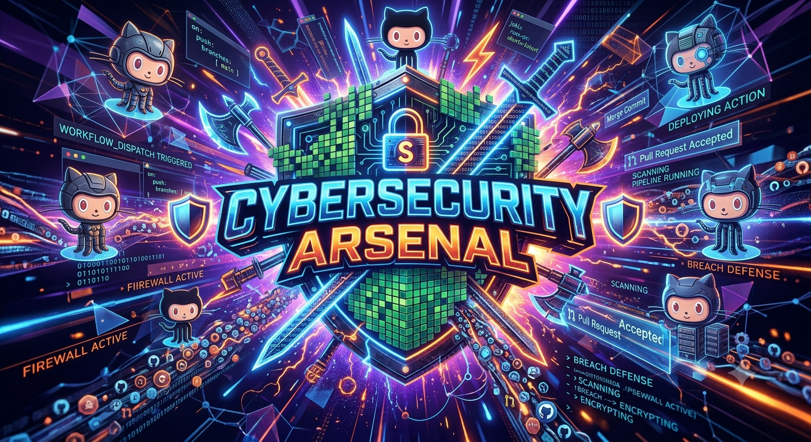

<p align="center">
  
</p>

<h1 align="center">🛡️ Cybersecurity Arsenal 🛡️</h1>

<p align="center">
  <b>A categorized, no-fluff reference of commands, techniques, and tools for Linux, Windows, Red Teaming, Blue Teaming & CTFs.</b>
</p>

<p align="center">
  
  
  
  
  
</p>

<p align="center">
  <i>⚠️ For educational purposes and authorized security testing only. Always operate within legal boundaries and signed scope.</i>
</p>

---

## 📚 What's Inside

This repo is a living knowledge base split into five focused categories. Each folder is a standalone, deeply detailed reference — click in and go deep.

                             | 📝 Description                                                                                                  
 | --------------------------------------------------------------------------------------------------------------- |
| 🐧 Every essential Linux command — navigation, permissions, networking, process mgmt, priv-esc enum, one-liners |
| 🪟 CMD, PowerShell, Registry, Event Logs, Active Directory enumeration, priv-esc checks                         |
| 🔴 Full offensive playbook — recon, exploitation, AD attacks, C2, lateral movement, persistence                 |
| 🔵 Defensive playbook — SIEM, threat hunting, IR, forensics, detection engineering                              |      
| 🏁 Best platforms to practice on, category toolkits, and competition strategy                                   |

---

## 🗂️ Repository Structure

```text
cybersec-arsenal/
├── README.md
├── banner.png
│                 
├── linux-commands/
│   └── README.md
├── windows-commands/
│   └── README.md
├── red-teaming/
│   └── README.md
├── blue-teaming/
│   └── README.md
└── ctf-platforms/
    └── README.md
```

---

## 🚀 Quick Start

```bash
git clone https://github.com/yourusername/cybersec-arsenal.git
cd cybersec-arsenal
```

Browse any folder — every file is a self-contained, detailed markdown reference with tables, command examples, and pro tips.

---

## 🎯 Who This Is For

* 🎓 Students learning offensive/defensive security fundamentals
* 🧑‍💻 CTF players who want a fast command lookup during competitions
* 🛡️ SOC analysts and blue teamers building detection/response muscle memory
* 🕵️ Pentesters/red teamers who want a structured methodology reference
* 📖 Anyone prepping for certs like OSCP, CEH, Security+, eJPT, CySA+

### 👤 Maintainer

**Praveen Rathod**

📧 **Email:** [pryz6459@gmail.com](mailto:pryz6459@gmail.com)

🔐 **TryHackMe:** [RadheKarn](https://tryhackme.com/p/RadheKarn)

✍️ **Medium:** [@pr9826163](https://medium.com/@pr9826163)

---

## ⚖️ Legal Disclaimer

All content in this repository is intended **strictly for educational purposes, authorized penetration testing, CTF competitions, and personal lab environments**. The author(s) are not responsible for any misuse of this information. Always obtain proper authorization before testing any system you do not own.

---

## 📄 License

This project is licensed under the [MIT License](LICENSE).

---

<p align="center">
  Made with ☕ and a lot of <code>✌️😊</code> .
</p>

---

## 👨‍💻 About the Author

<p align="center">
  <b>Praveen Rathod</b><br>
  Cybersecurity Learner & Engineering Student
</p>

<p align="center">
  <a href="mailto:[pryz6459@gmail.com](mailto:pryz6459@gmail.com)">📧 Email</a> •
  <a href="https://tryhackme.com/p/RadheKarn">🔐 TryHackMe</a> •
  <a href="https://medium.com/@pr9826163">✍️ Medium</a>
</p>
